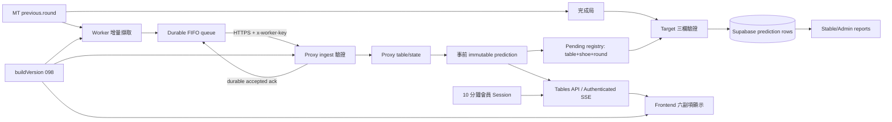

# v098 修復契約

狀態：設計／測試契約，未授權實作、commit 或部署。基線為 `f00eb1c`（tag `v097.1-舊策略停用與副門檻邊界修復`）。本文件是 v098 的 release gate；任何實作者都必須先寫 RED 測試，再做最小修復，最後通過 GREEN 與全域驗收。

## 只讀盤點與契約權威

本契約只讀檢查了 `proxy/src`、`proxy/test`、`frontend/src`、frontend 既有測試、`cloud-browser-worker/src`、`cloud-browser-worker/test` 與公開 SQL／release 文件；未讀取 `.env`、秘密值或雲端設定值。

目前可見風險如下：`proxy/src/server.js` 在完成局事件後才呼叫 `buildLivePrediction`；`buildPredictionResultRow` 對副預測與 action 另行計算；`stable-report.js` 有獨立預測器；worker pusher 只保存一筆 latest snapshot 且任意 2xx 即刪 queue；會員前台只保存登入布林；SSE 沒有會員授權；admin session 仍接受 query token；worker key 未設定時可放行；管理報表檔案仍保留依分數與舊門檻重推 action 的 helper；proxy、state、worker、package 與 frontend 的版本標示不一致。

若舊文件、舊測試名稱或舊程式常數與本契約衝突，以本契約的不可變 v097 規則與下列 API 契約為準；既有矛盾必須成為 RED 測試，不得以修改核准規則消除測試。

## 全域不可變條件與禁止變更

- 不得改動 v097 核准策略身分 `v097_副預測命中校準與門檻降5版`；v098 是可靠性／安全性 release，不是新預測策略。
- 主預測沿用 v097／v096 現行正式 `ALL_MT_EQUAL_MAIN_WEIGHTS` 與既有主邏輯；本次不得新增、刪除、改名、改比例或以報表舊權重取代。驗收以目前已核准常數與既有 `v097 live prediction` 測試為唯一基準，不採用舊文件中的其他比例。
- v097 核准副權重固定為：和局 65/5/5/5/20；超六 40/15/40/5；莊對 5/5/10/50/30；閒對 15/35/15/30/5；莊龍 10/5/40/35/10；閒龍 5/5/45/40/5。
- 核准 action 門檻固定為：和局 42、Super Six 60、莊對 48、閒對 50、莊龍寶 48、閒龍寶 52。達門檻才算「實際出手」，不可由賽果反推 action。
- 和局達門檻可出手；莊對與閒對可同時出手；對子只看各方前兩張牌同 rank，10/J/Q/K 同為 0 點不等於對子；Super Six 只有主預測為莊時才可出手；莊／閒龍寶必須與主預測方向一致。龍寶實際結果判定沿用現行核准 v097 規則，本次不得另加或更改點差門檻。
- 不得變更 v010 compact layout、元件位置、尺寸、色彩、文案層級或登入頁／管理頁版面；只允許接線、狀態與安全行為修復。前台與管理 UI 必須維持繁體中文。
- 不得把 MT token、session token、worker/control/ingest key、Supabase key 或 DB URL 放入前端 bundle、URL、query、log、錯誤訊息、報表或測試 fixture。
- 不得刪歷史資料、重寫已結算 prediction row、改 Git 設定、commit、push 或部署，除非另有明確授權。

## 共用資料模型與 API 契約

事前 prediction snapshot 是 backend 唯一來源，建立後 deep-freeze／clone-on-read；最小欄位如下，六個副項 key 必須完整且不能多一個：

```json
{
  "source": "backend",
  "strategyVersion": "v097_副預測命中校準與門檻降5版",
  "targetTableId": "BAG01",
  "targetShoe": "123",
  "targetRound": 18,
  "createdAt": "ISO-8601",
  "predictedResult": "banker|player",
  "confidence": 30,
  "probabilities": {},
  "scoreTotals": {},
  "sidePredictions": {
    "tie": 0,
    "superSix": 0,
    "bankerPair": 0,
    "playerPair": 0,
    "bankerDragon": 0,
    "playerDragon": 0
  },
  "sideActions": {
    "tie": false,
    "superSix": false,
    "bankerPair": false,
    "playerPair": false,
    "bankerDragon": false,
    "playerDragon": false
  }
}
```

- `GET /api/tables` 與 SSE `GET /api/tables/stream` 只能傳回上述 backend snapshot；缺失、過期或識別不符時傳回 unavailable/stale 狀態，不得前端計算或沿用舊 action。
- `POST /api/online-license/member-login` 成功回 `{ ok, memberSessionToken, sessionExpiresAt }`；固定最長 10 分鐘、server-side 驗證、到期或授權失效立即 401。會員資料 API 使用 `Authorization: Bearer <token>`；token 不得出現在 URL、query、SSE query、redirect location 或 log。
- SSE 必須使用可帶 Authorization header 的 fetch stream（或同等 header/cookie 方案）；原生 `EventSource(...?token=...)` 不合格。admin session 也不得再從 query 讀取。
- `POST /api/cloud-ingest/snapshot` 只接受 HTTPS worker、`x-worker-key`、新鮮 timestamp、單調 sequence 與有效 schema。成功 ack 固定為 `{ ok:true, accepted:true, duplicate:boolean, sessionId, sequence, acceptedRoundKeys:[...] }`；只有 durable apply 成功才可 `accepted:true`。
- worker 增量 envelope 固定包含 `protocolVersion:"v098"`、`sessionId`、`timestamp`、`sequence`、`snapshot.tables` 與本次尚未 ack 的 `snapshot.rounds`。round key 固定為 `tableId:shoe:round`。
- `GET /health`、`GET /api/status`、worker `GET /health` 與 frontend build metadata 必須同時暴露 `buildVersion:"098"`；`strategyVersion` 仍是 v097，兩者不可混用。

## 13 項唯一修復契約

### V098-FIX-01 — 不可變事前主／副預測

- 責任服務：proxy prediction lifecycle、state store。
- 輸入：尚未揭露結果的桌況 `(targetTableId, targetShoe, targetRound)`。
- 輸出：一次建立的完整 prediction snapshot；主方向、信心、六副分數與六副 action 在結算前後 byte-for-byte 相同。
- fail-closed：若結果欄位已存在、識別不完整或同 target 已有不同 snapshot，拒絕建立／覆寫並記錄遮罩後錯誤；不提供替代預測。
- RED 測試命令：`node --test proxy/test/v098-prediction-lifecycle.test.js --test-name-pattern="immutable pre-result"`
- GREEN 驗收命令：`node --test proxy/test/v098-prediction-lifecycle.test.js`

### V098-FIX-02 — 結算不得重算且保存具原子性

- 責任服務：proxy state store、Supabase writer。
- 輸入：完成局實際結果與完全匹配的 pending prediction snapshot。
- 輸出：prediction row 原樣保存事前主／副值，只新增 actual、`is_hit`、`side_actual_results`、`side_hits`、`resolved_at`；action 仍取事前 `sideActions`。
- fail-closed：缺 pending 或 persist 失敗時不得 fallback 重算，也不得先刪 pending；保留同一 pending 供冪等重試。只有兩張必要 row 都 durable 成功後才 ack 結算並清 pending。
- RED 測試命令：`node --test proxy/test/v098-prediction-lifecycle.test.js --test-name-pattern="settlement|persist failure"`
- GREEN 驗收命令：`node --test proxy/test/v098-prediction-lifecycle.test.js proxy/test/v098-persistence-atomicity.test.js`

### V098-FIX-03 — stable report 與保存 row 完全一致

- 責任服務：proxy stable report、report persistence、online core。
- 輸入：已保存的 immutable prediction/settlement rows；固定跨靴、和局、雙對、Super Six、單邊龍寶 fixture。
- 輸出：stable report 的逐桌與 total rounds/actions/hits/rates 與保存 rows 精確相等；不得呼叫另一套 predictor 或門檻重算。
- fail-closed：缺識別、缺事前 action 或同 round 有矛盾 row 時，報表標記 invalid 並排除該 row；不得猜測。恢復 `deepEqual` 精確斷言，禁止只驗型別、範圍或 `>= 0`。
- RED 測試命令：`node --test proxy/test/v098-stable-report-contract.test.js`
- GREEN 驗收命令：`node --test proxy/test/v098-stable-report-contract.test.js proxy/test/stable-report-v015.test.js proxy/test/stable-report-v016.test.js proxy/test/stable-report-v017.test.js`

### V098-FIX-04 — worker 增量、durable queue、ack 與換靴去重

- 責任服務：cloud-browser-worker snapshot/pusher、proxy ingest。
- 輸入：MT 完成局（優先 `previous.round`）與桌況更新；斷網、重啟、duplicate ack、sequence 重送、同桌換靴。
- 輸出：未 ack round 依 FIFO durable 保存；每次只傳新增或未 ack rounds；只在 ack 的 `sessionId+sequence+acceptedRoundKeys` 完全匹配後移除。去重 key 含 table+shoe+round，新靴 round 1 不被舊靴 round 1 吞掉。
- fail-closed：網路／非 2xx／redirect／無效 JSON／ack 不匹配皆保留 queue；queue 損壞須隔離並停止送新資料，不得覆蓋成 latest-only 或宣告成功。
- RED 測試命令：`node --test cloud-browser-worker/test/v098-incremental-delivery.test.js proxy/test/v098-ingest-ack.test.js`
- GREEN 驗收命令：`node --test cloud-browser-worker/test/v098-incremental-delivery.test.js cloud-browser-worker/test/snapshot-pusher.test.js cloud-browser-worker/test/stale-payload.test.js && node --test proxy/test/v098-ingest-ack.test.js proxy/test/cloud-ingest-snapshot.test.js`

### V098-FIX-05 — 正式策略唯一 active

- 責任服務：proxy strategy seed/writer、Supabase migration／資料約束。
- 輸入：啟動 seed、重啟、重跑 migration、已有多筆 legacy active 的資料狀態。
- 輸出：只允許 `v097_副預測命中校準與門檻降5版` 為 active；所有 legacy 只能 archived/rollback 歷史，DB 有唯一 active 防線。
- fail-closed：無 active 或多 active 時停止產生／保存正式 prediction，health/status 回 degraded；不得挑最新一筆或 fallback 舊策略。
- RED 測試命令：`node --test proxy/test/v098-active-strategy.test.js`
- GREEN 驗收命令：`node --test proxy/test/v098-active-strategy.test.js proxy/test/prediction-v097-red.test.js proxy/test/prediction-v096.test.js`

### V098-FIX-06 — 前台六副項、backend 唯一來源、stale fail-closed

- 責任服務：proxy tables/SSE、frontend live client/App 接線；layout 不變。
- 輸入：含六副分數／actions 的 backend prediction，以及缺欄位、錯 target、逾時或斷線 payload。
- 輸出：前台呈現 tie、superSix、bankerPair、playerPair、bankerDragon、playerDragon 六項 backend 值與 action；不以 outcome probability、local helper 或保存的 last-good action 取代。
- fail-closed：任何六副 key 缺失、snapshot stale、session 無效或 target 不符，清除預測 action 並顯示繁中「資料過期／預測暫不可用」；不得保持 connected 或顯示舊下注訊號。
- RED 測試命令：`npm --prefix frontend test -- src/lib/liveClient.v098.test.ts src/App.v098.test.tsx && node --test proxy/test/v098-backend-prediction-source.test.js`
- GREEN 驗收命令：`npm --prefix frontend test -- src/lib/liveClient.v098.test.ts src/App.v098.test.tsx && node --test proxy/test/v098-backend-prediction-source.test.js`

### V098-FIX-07 — 管理報表只讀保存的 side_actions

- 責任服務：proxy license admin analytics、online core report reader、frontend admin report mapping。
- 輸入：`daily_prediction_results.prediction_features.side_actions/side_hits` 與保存的 stable report totals。
- 輸出：逐桌、每日和／對／龍／超六 action、hit、rate 只按已保存 boolean 聚合；同一保存資料在 SQL 路徑與 fallback 路徑結果相同。
- fail-closed：缺 `side_actions` 的 row 不算 action；不得由 `side_predictions`、目前門檻、賽果或 legacy `SIDE_THRESHOLDS` 重建。資料不全回 `-`/unavailable，不回虛構 0%。
- RED 測試命令：`node --test proxy/test/v098-admin-side-actions.test.js`
- GREEN 驗收命令：`node --test proxy/test/v098-admin-side-actions.test.js proxy/test/online-memory-v026.test.js proxy/test/v091-db-compact.test.js && npm --prefix frontend test -- src/App.v098.test.tsx`

### V098-FIX-08 — 會員短效 session 且 token 不進 URL／SSE query

- 責任服務：proxy member session/auth middleware、frontend login/live transport。
- 輸入：有效會員帳號與驗證碼、過期／撤銷授權、10 分鐘到期、tables poll 與 SSE reconnect。
- 輸出：opaque member token 與 server-side expiry；受保護讀取一律走 Authorization header，前端到期即清 session 並回登入頁。
- fail-closed：session store/key 未就緒、token 遺失／過期／撤銷、query 出現任何 session token 時回 401/400 並不開 stream；不得降級成 `darven-member-login=yes` 或匿名 tables。
- RED 測試命令：`node --test proxy/test/v098-member-session.test.js && npm --prefix frontend test -- src/lib/liveClient.v098.test.ts src/lib/onlineLicenseClient.v098.test.ts`
- GREEN 驗收命令：`node --test proxy/test/v098-member-session.test.js && npm --prefix frontend test -- src/lib/liveClient.v098.test.ts src/lib/onlineLicenseClient.v098.test.ts`

### V098-FIX-09 — control／ingest／worker 全面 fail-closed

- 責任服務：proxy control/ingest middleware、cloud-browser-worker admin auth。
- 輸入：key 未設定、空值、錯值、錯 Origin、過大／過期／格式錯誤 payload。
- 輸出：control 只收 `x-control-token`/Authorization，ingest 只收 `x-worker-key`，worker snapshot/reload 只收指定 header；比較採 timing-safe，錯誤無秘密。
- fail-closed：正式／cloud mode 缺任一必要 key 時對受保護端點回 503；錯 key 回 401、錯 Origin 回 403、schema 錯回 400/409/413；絕不因「未設定」而公開放行。
- RED 測試命令：`node --test proxy/test/v098-fail-closed.test.js && node --test cloud-browser-worker/test/v098-fail-closed.test.js`
- GREEN 驗收命令：`node --test proxy/test/v098-fail-closed.test.js proxy/test/v093-control-and-throttle.test.js proxy/test/cloud-ingest-snapshot.test.js && node --test cloud-browser-worker/test/v098-fail-closed.test.js cloud-browser-worker/test/admin-auth.test.js`

### V098-FIX-10 — 正式鏈路只允許 HTTPS 且禁止 redirect

- 責任服務：proxy outbound cloud capture/ingest config、worker navigation/pusher、frontend cloud API resolver。
- 輸入：production/cloud URL、HTTP URL、30x response、跨 host redirect；local loopback 開發 URL。
- 輸出：正式 frontend→proxy、worker→proxy、proxy→worker 與 MT navigation 全為 `https:`，所有 server-side fetch/navigation 設定 no-follow/error redirect。
- fail-closed：正式 URL 非 HTTPS、redirect 或最終 origin 改變即拒絕啟動該資料鏈路並回 degraded/錯誤；只允許明確 local mode 的 `127.0.0.1`/`localhost` HTTP，不可自動升級或跟隨 30x。
- RED 測試命令：`node --test proxy/test/v098-https-no-redirect.test.js && node --test cloud-browser-worker/test/v098-https-no-redirect.test.js && npm --prefix frontend test -- src/lib/apiBase.v098.test.ts`
- GREEN 驗收命令：`node --test proxy/test/v098-https-no-redirect.test.js && node --test cloud-browser-worker/test/v098-https-no-redirect.test.js && npm --prefix frontend test -- src/lib/apiBase.v098.test.ts`

### V098-FIX-11 — snapshot 限頻與 24 小時 retention

- 責任服務：worker snapshot endpoint/pusher、proxy snapshot persistence、Supabase cleanup migration。
- 輸入：高頻 GET／push、無新局 heartbeat、狀態轉換、新完成局、超過 24 小時 snapshot。
- 輸出：worker push 最快每 5 秒；`cloud_table_snapshots` 同 session 最多每 30 秒一筆，唯新完成局、換靴或連線狀態轉換可立即寫；`/snapshot` 每來源每分鐘最多 12 次，超量回 429 + `Retry-After`；snapshot 僅保留最近 24 小時。
- fail-closed：限頻器／cleanup 不可用時停止非必要 snapshot 寫入並回 degraded；不得影響完成局 durable queue，不得靠刪除未 ack round 降量。cleanup 僅刪 `snapshot_at < now()-24h`，不得刪 prediction/report 歷史。
- RED 測試命令：`node --test proxy/test/v098-snapshot-retention.test.js && node --test cloud-browser-worker/test/v098-snapshot-rate-limit.test.js`
- GREEN 驗收命令：`node --test proxy/test/v098-snapshot-retention.test.js proxy/test/v093-control-and-throttle.test.js && node --test cloud-browser-worker/test/v098-snapshot-rate-limit.test.js`

### V098-FIX-12 — build version 單一且一致

- 責任服務：proxy、frontend、cloud-browser-worker build metadata。
- 輸入：同一 v098 build artifact／commit。
- 輸出：四個公開面 `proxy /health`、`proxy /api/status`、`worker /health`、frontend metadata 都精確回 `buildVersion:"098"`，可另帶同一 commit SHA；package/service semver 不得冒充 strategy version。
- fail-closed：任兩服務 buildVersion 不同時 status 顯示 version_mismatch，前台停止顯示可下注 prediction；release gate 失敗。
- RED 測試命令：`node --test proxy/test/v098-build-version.test.js && node --test cloud-browser-worker/test/v098-build-version.test.js && npm --prefix frontend test -- src/lib/buildVersion.v098.test.ts`
- GREEN 驗收命令：`node --test proxy/test/v098-build-version.test.js && node --test cloud-browser-worker/test/v098-build-version.test.js && npm --prefix frontend test -- src/lib/buildVersion.v098.test.ts`

### V098-FIX-13 — prediction row 強驗 targetTableId＋shoe＋round

- 責任服務：proxy prediction registry、settlement validator、Supabase writer。
- 輸入：pending prediction target 與完成局 `(tableId, shoe, round)`；含跨桌、舊靴、跳局、duplicate、缺欄位 fixture。
- 輸出：只有三欄正規化後全等才可生成／upsert prediction row；row 的 `table_id/shoe_no/round_no` 必須直接取驗證後 target，不可各自 fallback 混用。
- fail-closed：任一欄缺失或不符即拒絕保存、保留 pending、記錄不含敏感值的 mismatch event；不得用 `round.tableId ?? table.tableId`、目前桌況或 sequence 猜測。
- RED 測試命令：`node --test proxy/test/v098-prediction-target.test.js`
- GREEN 驗收命令：`node --test proxy/test/v098-prediction-target.test.js proxy/test/live-prediction-v094.test.js proxy/test/v091-db-compact.test.js`

## 依賴圖



關鍵順序：worker 必須先 durable queue 再送；proxy 必須先 durable apply 再 ack；prediction 必須先於結果且 immutable；結算必須先驗 target、再保存、成功後才刪 pending；報表只能在保存 row 之後讀取。

## RED 建立順序與全域 GREEN

RED 階段先新增上述精確測試，確認每個命令因目標行為尚未成立而失敗；不得以 skip、暫緩標記、放寬 assertion、mock 掉安全檢查或改核准規則製造 GREEN。實作完成後除每項 GREEN 外，必須執行：

```powershell
npm --prefix proxy test
npm --prefix cloud-browser-worker test
npm --prefix frontend test
npm --prefix frontend run build
node --check proxy/src/server.js
node --check proxy/src/state-store.js
node --check proxy/src/supabase-writer.js
node --check proxy/src/stable-report.js
node --check proxy/src/license-admin.js
node --check cloud-browser-worker/src/server.js
node --check cloud-browser-worker/src/snapshot.js
node --check cloud-browser-worker/src/snapshot-pusher.js
```

GREEN 證據必須保存每條命令的 exit code 與摘要；不得使用真實 secrets。涉及 migration 的測試只能使用隔離 fixture／transaction，禁止連正式資料庫。

## Rollback

- 應用回滾目標：基線 commit `f00eb1c`／tag `v097.1-舊策略停用與副門檻邊界修復`，由 Hermes 或人工平台操作；本契約不執行回滾、部署或切流。
- rollout 必須能逐服務停用 v098；先停止 v098 worker push，再停止 proxy 接受 v098 envelope，最後回前端。未 ack worker queue 必須保留，回升 v098 後可續送；不得拿 v097 consumer 解析 v098 queue。
- DB 變更只能 additive/idempotent：唯一 active constraint、session／snapshot cleanup 所需物件可停用但不 drop 歷史表，不逆向改寫 prediction rows。rollback 前先停止 v098 writers。
- 若 v098 已寫入 buildVersion/protocolVersion 標記，回滾讀者必須忽略未知欄位但不得把 v098 pending 以 v097 邏輯結算。
- rollback 後仍須跑 v097 既有 prediction、stable report、ingest、worker、frontend build 測試；任何 pending/queue 數量不守恆時停止操作並人工核對。

## 不部署條件

任一條成立即禁止部署：13 項有任一 RED/GREEN 未通過；stable report 非精確一致；存在結算重算或 persist 前刪 pending；worker queue/ack/換靴測試不守恆；策略 active 不是唯一；前端自行計算或顯示 stale action；報表重推 side action；會員／admin／worker token 出現在 URL/query/log；任一 control/ingest/worker key 缺失卻放行；正式鏈路接受 HTTP 或 redirect；snapshot 限頻／24h retention 未驗證；buildVersion 不一致；target 三欄未全等；diff 含 secrets、未核准權重／門檻／規則／layout 變更、Git 設定變更或無關檔案。

本文件完成不代表 v098 可部署；只有 Hermes 審核 diff、測試證據、無 secrets 結果並另行明確授權後，才可進入 commit／deployment 流程。
